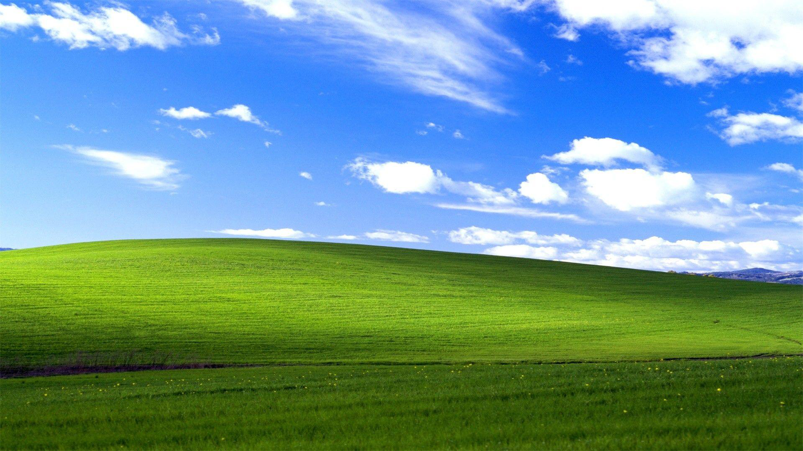
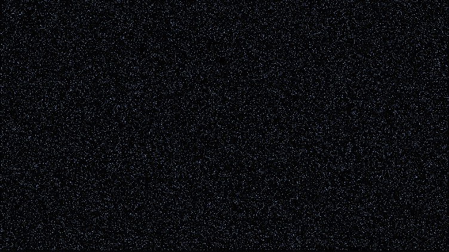

# StegoApp — JavaFX LSB Steganography Tool

**StegoApp** is a desktop JavaFX application for hiding and extracting text messages within images using the LSB (Least Significant Bit) steganography technique. It features a modern user interface with zooming, dark mode, and the ability to visually compare images.


---


## 🔧 Features

- 📥 Load images (via file chooser or drag & drop)
- 🔐 Encode text into an image using LSB
- 🔓 Decode hidden text from an image
- 🔄 Toggle between:
    - Original image
    - Encoded image
    - Difference view (visual comparison)
- 🔍 Zoom in and out
- 🌙 Light/Dark theme toggle
- ⚠️ Error handling (e.g., `MessageTooLargeException`)
- 📦 Windows MSI installer built with `jlink` + `jpackage` (bundled runtime, no separate JRE required)

---

## 🚀 Technologies Used

- **Java 17+**
- **JavaFX**
- **Gradle** (build system)
- Custom implementation of LSB steganography

---

## ▶️ How to Run

### With Gradle:

```bash
./gradlew run
```

### 🛠️ Build Standalone Application
To generate a fully self-contained build with a custom Java Runtime (no need to install Java separately):

```
./gradlew jlink jpackage
```
This will create a directory:
```
build/image/StegoApp
```
It includes:

Executable application

All required dependencies

A minimal embedded JRE tailored for this app.


### 🔄 Difference View

<table>
  <tr>
    <td align="center">
      <b>Original</b><br>
      
    </td>
    <td align="center">
      <b>Encoded</b><br>
      <br>
    </td>
  </tr>
</table>

**Note:** The encoded image contains **45,000 hidden characters**, and this is **not the maximum capacity** of the algorithm.  
You can hide even more text depending on the image size.


<table>
  <tr>
    <td align="center">
      <b>Binary Difference</b><br>
      
    </td>
    <td align="center">
      <b>RGB Difference</b><br>
      
    </td>
  </tr>
</table>

<i>These images show the differences after encoding the text into the original image. You can see both binary and RGB changes.</i>


